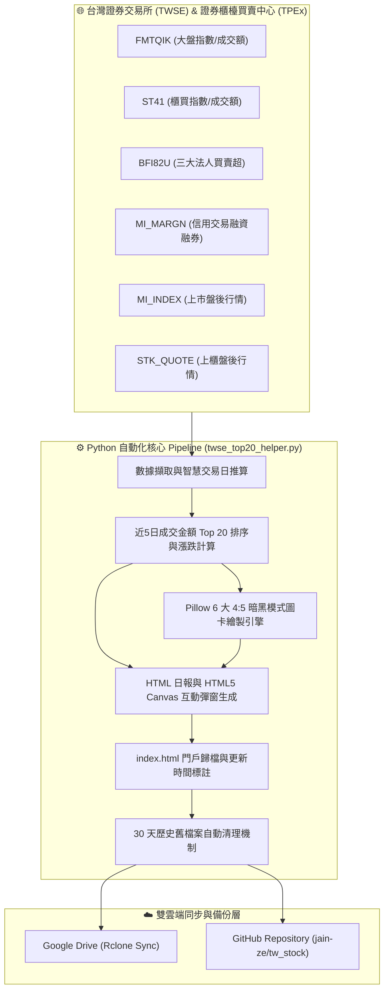

# 《台股盤後大數據與籌碼動向觀測站》
## 軟體開發規格書、系統架構設計理念與功能介紹報告

---

### 📋 一、專案定位與系統使命 (System Positioning & Mission)

**《台股盤後大數據與籌碼動向觀測站》**（Taiwan Stock After-Market Big Data & Capital Flow Station）是一套專為台灣股市（上市 TWSE 與上櫃 TPEx）打造的全自動化、高資訊密度、雙雲端同步且具備精緻視覺化圖卡之盤後籌碼與爆量個股深度分析系統。

本系統旨在解決傳統股市盤後資訊零碎、圖表缺乏整合、信用交易數據公佈延遲以及人工手動整理費時等痛點。透過自動化 Pipeline、多軸視覺化圖表與現代化暗黑 UI 門戶，為投資人與研究人員提供全方位的盤後決策支援。

---

### 💡 二、核心設計理念 (Core Design Philosophy)

1. **零人工介入的全自動化流程 (Zero-Touch Automation Architecture)**
   - 系統無需人工操作，自動於每個交易日固定時段執行 TWSE 與 TPEx 官方 API 數據擷取、清洗、計算、圖卡生成、HTML 日報建置、入口網站歸檔以及雙雲端同步。

2. **資訊密度與現代美學的完美平衡 (Aesthetics & Information Density)**
   - 採用 GitHub 暗黑高階配色系 (`#0D1117`, `#161B22`, `#30363D`)，減少視覺疲勞並提升文字與數據閱讀對比。
   - 設計 4:5 比例高解析社群與行動裝置最適化社群圖卡（PNG），兼具美觀與攜帶性。

3. **雙時段排程與動態容錯機制 (Dual-Schedule & Dynamic Fallback)**
   - 針對證券交易所信用交易（融資融券）通常於夜間（接近 21:00）才公佈之特性，創新設計 **16:00 (盤後初版)** 與 **21:00 (信用交易完整版)** 雙排程機制。
   - 若數據尚未發布，系統精準顯示「**尚未更新**」，避免以 `0.00 億` 等錯誤數據誤導判讀。

4. **多維度互動與使用者體驗極致化 (Interactive UI/UX & Preference Memory)**
   - 主視圖提供 **「📈 大盤籌碼與 TOP 20 數據榜單」** 與 **「🖼️ 6 大高解析圖卡展示區」** 獨立頁籤切換。
   - 點擊任何個股即刻跳出 HTML5 Canvas 雙軸互動圖表彈窗，完整呈現近 5 日股價與量能。
   - 入口門戶持久化記憶使用者偏好（卡片檢視 / 條列檢視），大幅提升留存與使用體驗。

---

### 🏗️ 三、系統架構與技術規格 (System Architecture & Specifications)

#### 1. 技術棧 (Technology Stack)
- **後端邏輯與數據處理引擎**：Python 3.14+ (內建 `urllib.request`, `json`, `csv`, `base64`, `glob`, `subprocess`, `argparse`)
- **影像繪圖與圖卡生成引擎**：Pillow (PIL Image, ImageDraw, ImageFont) 搭配 Noto Sans CJK 高解析中文字型
- **前端呈現與互動介面**：HTML5, Modern ES6+ JavaScript, Vanilla CSS3 (CSS Custom Properties), HTML5 Canvas 視訊繪圖
- **雲端同步與備份層**：
  - Google Drive：Rclone CLI (`gdrive:近5日台股成交金額TOP20深度分析`)
  - GitHub Repository：Git CLI (`git push --force` to `https://github.com/jain-ze/tw_stock.git`)
- **排程引擎**：Google Antigravity Background Scheduler (Cron: `0 16 * * 1-5` & `0 21 * * 1-5`)

#### 2. 系統架構拓樸圖 (System Architecture Topology)

---

### 🧩 四、核心模組與功能介紹 (Core Features & Module Breakdown)

#### 1. 大盤與櫃買雙折線圖模組 (Market Index Dual Line Chart Module)
- 抓取近 5 個交易日集中市場加權指數與櫃買市場指數。
- 計算當日漲跌點數、漲跌幅 (%) 與總成交金額（億元）。
- **圖卡一 (Card 1)** 自動繪製雙指數 5 日走勢圖，並以藍色（TWSE）與金色（TPEx）雙線標示點位趨勢。

#### 2. 三大法人籌碼 4 系列柱狀圖模組 (Institutional Investors 4-Series Bar Chart)
- 精準統計外資及陸資、投信、自營商（自行買賣+避險）以及三大法人合計金額（億元）。
- **圖卡二 (Card 2)** 繪製 5 日獨立柱狀圖，以四種主題色彩（藍、紫、黃、綠/紅）直觀展現籌碼進出變化。

#### 3. 信用交易融資融券變動模組 (Margin Trading Balance & Change Module)
- 監控市場散戶與內資籌碼浮動指標：融資金額餘額/今日增減（億元）與融券張數餘額/今日增減（張）。
- **圖卡三 (Card 3)** 繪製近 5 日融資增減柱狀圖，未公佈時動態標示「**尚未更新**」。

#### 4. Top 20 成交金額強勢股與雙維度漲跌 (Top 20 Trading Value Stocks Module)
- 跨 TWSE 與 TPEx 統計 5 日總成交金額前 20 名大飆股與權值巨頭。
- 顯示 **「當日漲跌 (元/%)」** 與 **「5 日波段漲跌幅 (%)」** 雙維度價格變化，幫助區分是單日強勢或波段主流。
- 生成 **圖卡四 (TOP 20 總覽卡)**、**圖卡五 (Top 1~10 巨頭卡)**、**圖卡六 (Top 11~20 潛力卡)**。

#### 5. HTML5 Canvas 個股走勢雙軸互動彈窗 (Interactive Stock Detail Modal)
- 點擊榜單任意個股列，即刻開啟彈窗。
- 利用 HTML5 Canvas 於瀏覽器前端動態繪製 **股價折線 (紅) + 每日成交金額柱狀圖 (藍/綠)** 雙軸圖表。
- 附帶 5 日歷史每日數據表格，呈現收盤價、當日漲跌、5日累計漲跌、成交額與成交量。

#### 6. 入口門戶網站與檢視偏好記憶 (Index Portal & View Memory)
- 入口網站 [index.html](file:///home/jrh/桌面/JRH20260720/近5日台股成交金額TOP20深度分析/index.html) 依日期由新到舊歸檔歷日分析報告與 CSV 檔。
- 英雄區顯眼標註 **`🕒 最新系統資料更新時間：YYYY-MM-DD HH:MM:SS`**。
- 整合 `localStorage` 技術，記憶使用者選擇之 **🎴 卡片檢視** 或 **📋 條列檢視** 模式。

---

### 🛡️ 五、系統維護、自動化排程與安全性 (Maintenance & Security)

| 項目 | 機制與規格 |
| :--- | :--- |
| **工作日雙排程** | 每週一至週五 `16:00` (盤後初版) 與 `21:00` (信用交易完整版) 自動觸發 |
| **舊檔案滾動清理** | 每次執行自動掃描並刪除超過 30 天之舊日報、圖卡與 CSV，維持硬碟空間健康 |
| **GitHub 憑證安全** | 使用 GitHub Personal Access Token (PAT) 搭配 `git credential.helper store` 持久化，傳輸加密 |
| **節假日動態回溯** | 自動過濾非交易日與休市日，逆向推算最新 5 個有效交易日，確保資料連續性 |

---
*報告產生時間：2026-07-24*  
*系統版本：v3.5.0 (Final Release)*
